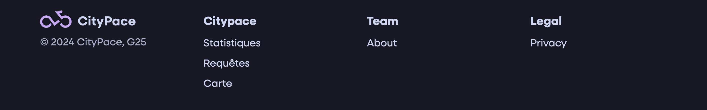
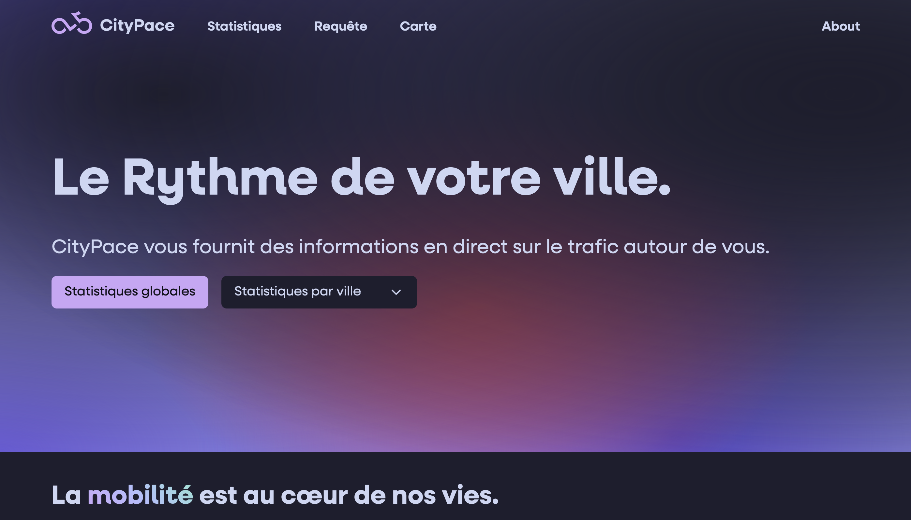
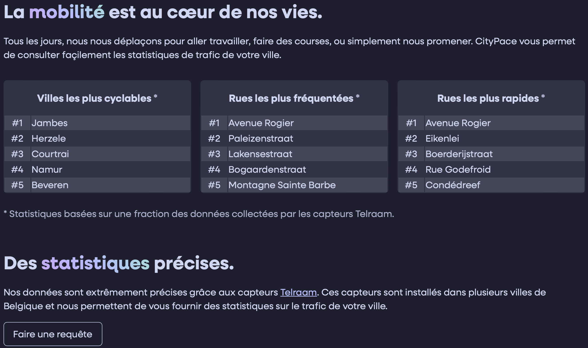
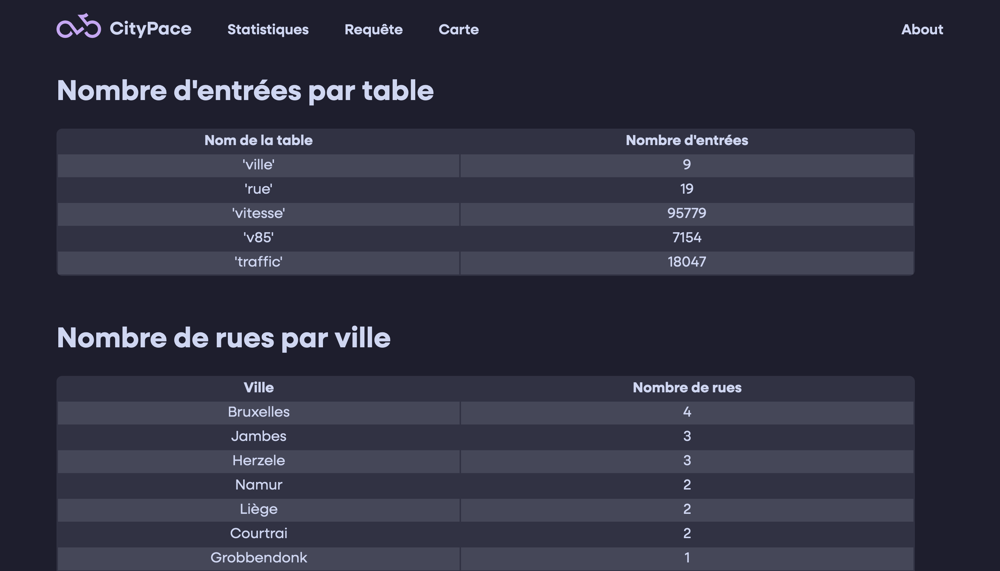
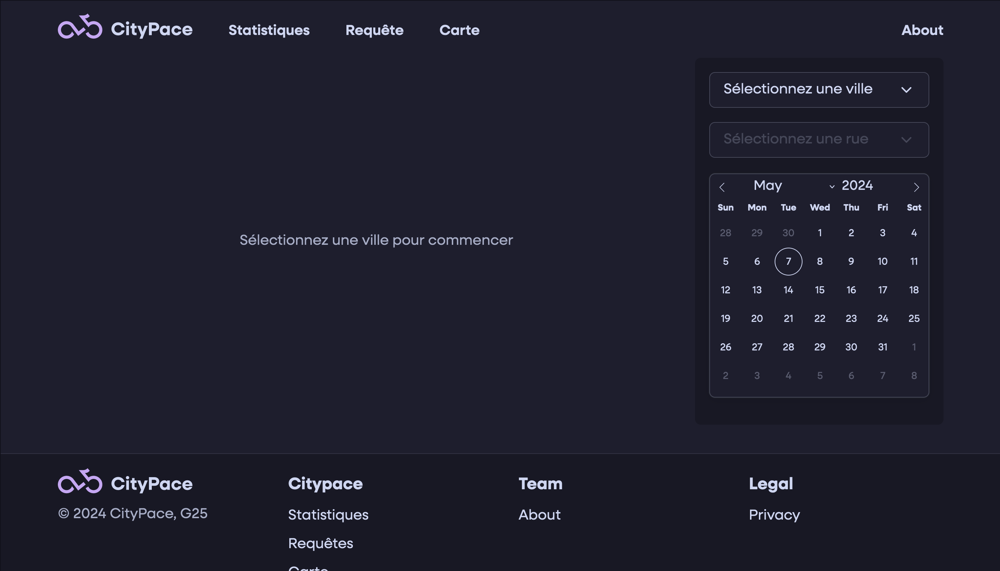
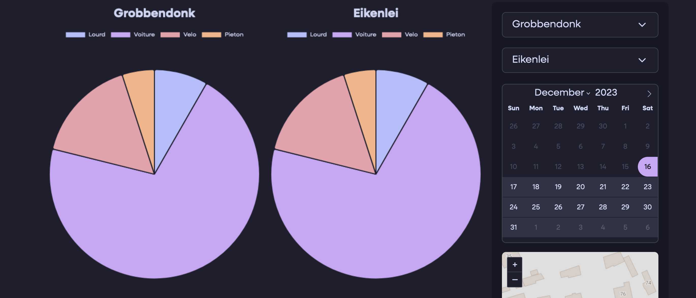
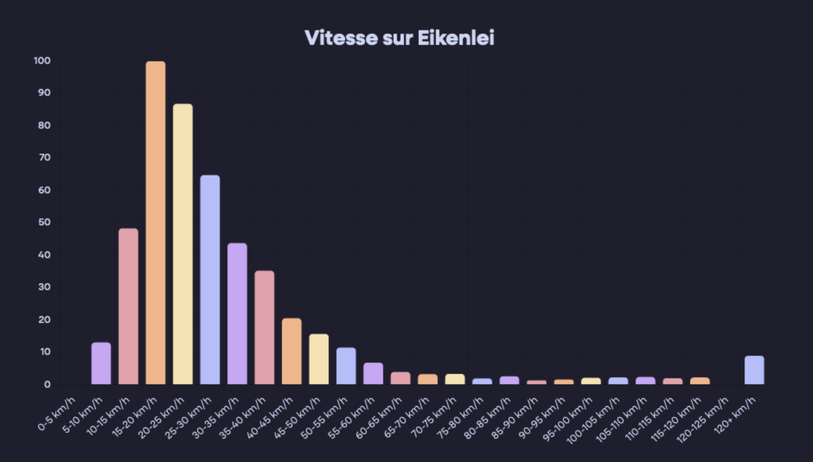
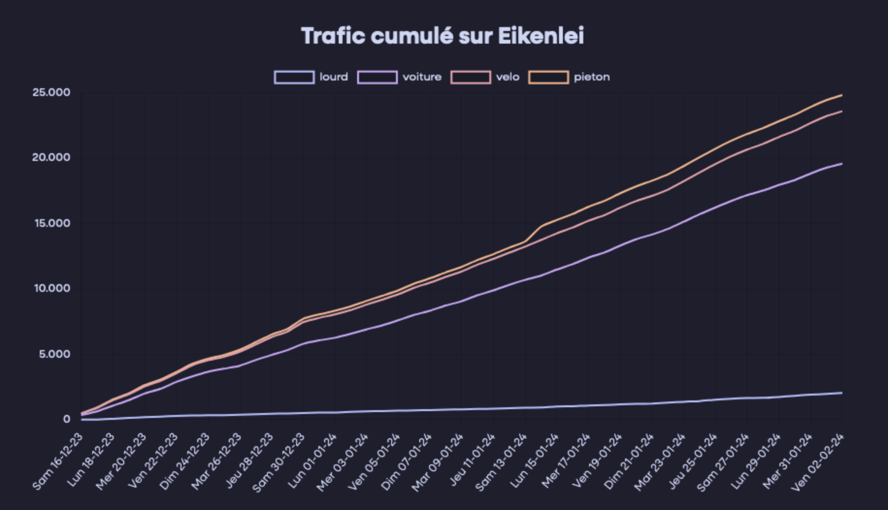
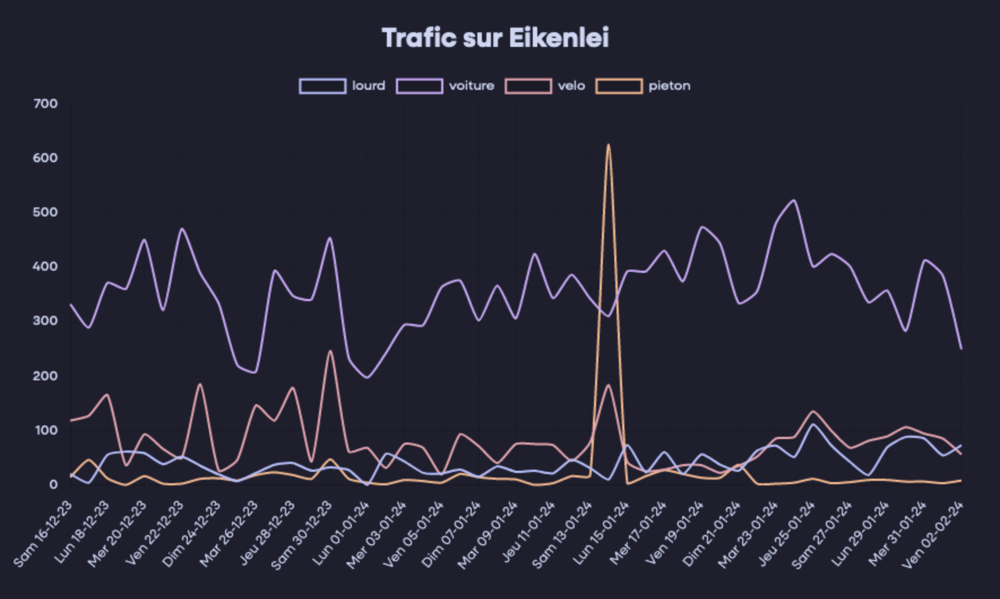
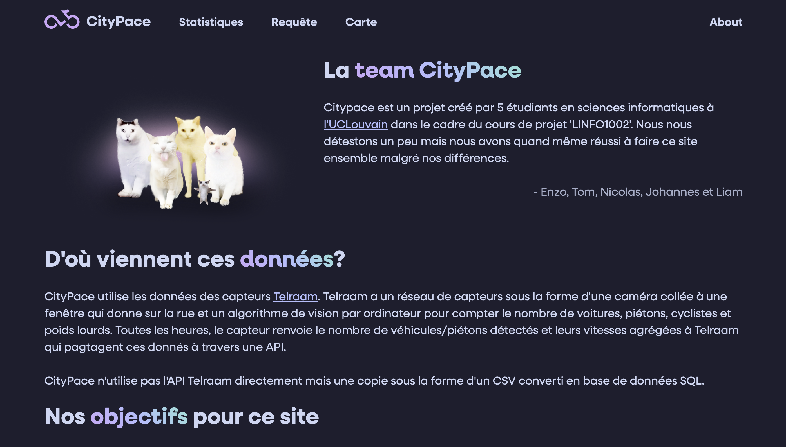

# Rapport final projet LINFO1002
- Johannes Radesey 07042301
- Tom Deglume 66572300
- Enzo Andrade Orletti 34842300
- Liam Vander Becken 77932300
- Nicolas Mertens 69132300

## Introduction

Bonjour, dans ce rapport nous tenons à vous présenter notre projet "CityPace" initié dans le cadre du cours "LINFO1002" à l'UCLouvain. Il s'agit d'un site web fournissant des données pour l'étude de la mobilité en Belgique. Nous allons d'abord vous présenter notre site puis parler des stratégies de tests automatiques nous permettant de garder un site stable.

## Présentation du Site

Avant même que vous chargez une page, notre site s'adapte à votre appareil afin de garantir une utilisation adaptée et consistante à travers tout le site.

 

Situé en haut, se trouve la barre de navigation qui vous permet d'accéder aux pages les plus importantes du site.

 

Dans un même objectif, vous pouvez retrouver un footer en bas de chaque page pour ne pas devoir remonter pour naviguer

### Page d'acceuil

En arrivant sur le site vous serai réceptionné par une page d'accueil présentant le site et permettant à l'utilisateur d'effectuer une action rapidement.

 

On peut y retrouver quelques statistiques générales et une description de nos services.

### Statistiques

Sur la page statistique vous pouvez retrouver des statistiques globales telles que :
- Le nombre d'entrées par table dans notre base de données
- Nombre de rues par ville
- Villes les plus cyclables
- Liste des villes
- Liste des rues
- Le taux de cyclistes les jours de pleine lune 

### Requête

Sur la page requête vous pouvez effectuer une requête pour une ville ou pour une rue. Il est possible de sélectionner une date de début et une date de fin et de voir l'emplacement géographique de la rue sur une carte.

L'url de la page requête est modifiée pour chaque requête pour que l'utilisateur puisse partager le lien.

 

Les statistiques vous sont présentées sous forme de graphiques interactifs. Il est possible de cacher certains types de véhicules des statistiques affichées.

 

Le ratio de types de véhicules est affiché pour la ville et la rue sous la forme d'un diagramme circulaire. Nous avons choisi cet affichage car c'est un moyen très visuel de représenter ces données et l'utilisateur peut facilement les comparer entre elles.

 

Le ratio de types de véhicules par jour de la semaine est représenté sous la frome d'un graphique en barres. Nous avons choisi cet affichage car il est le plus approprié pour ces données.
<!-- ici il faut développer un peu plus -->

 

Les vitesses sur la rue sélectionnée sont représentées sous la forme d'un graphique en barres qui montre le ratio de véhicules qui se déplacent à chaque tranche de vitesse. Nous avons choisi cet affichage comme ça l'utilisateur peut directement voir les vitesses les plus communes dans la rue

 

L'évolution du nombre de chaque type de véhicule observé pendant la période sélectionnée est représentée sous la forme d'un graphique cumulatif. Nous avons choisi cet affichage pour que l'utilisateur puisse observer les changements drastiques visuellement.

 

L'évolution du nombre de chaque type de véhicule observé pendant la période sélectionnée est aussi représentée de manière non cumulative. Nous avons choisi ce affichage pour que l'utilisateur ai une autre perspective de ces données.

### Carte 

Pour notre fonctionnalité supplémentaire on a choisi d'implémenter une carte qui nous permet d'observer l'emplacement géographique des rues dans notre base de données car nous trouvons que c'est une information qui pourrait être utile à l'utilisateur. Les rues qui possèdent ces capteurs ont une petite icône représentent un capteur telraam qui nous permet de les identifier facilement. Quand on clique sur une icône, quelques statistiques sont affichées ainsi qu'un bouton pour afficher les statistiques complètes. L'url est aussi modifiée pour que l'utilisateur puisse partager le lien.

Les coordonnées géographiques pour chaque rue sont générées pendant l'initialisation de base de données et nous proviennent de l'API nominatim. Celle-ci nous retourne les coordonnées en échange d'un nom de rue.
<!-- rephraser -->

### About

Sur la page about vous pouvez apprendre plus sur notre projet, notre équipe, nos objectifs et nos sources pour les données.

## Stratégies de tests et code coverage

À la fin de la phase 2 du projet, nous avons reçu en retour que le taux de coverage du code était d'environ 50%. Par conséquent, cela constituait l'un des points à améliorer pour la phase 3.

En débutant la phase 3 et dans le but d'augmenter ce taux de coverage, nous avons établi une stratégie reposant sur le fichier 'index.html' (généré en saisissant 'coverage html' sur le terminal) situé dans le répertoire 'htmlcov'. En ouvrant 'index.html' dans le navigateur, nous avons pu obtenir une bonne appréhension de ce que nos tests créés couvraient réellement dans le code et de ce qui pourrait encore être amélioré.

Ainsi, la stratégie initiale consistait à identifier les fichiers présentant les taux de couverture les plus faibles et à créer de nouveaux fichiers de tests pour ceux-ci dans leur ensemble. Ensuite, nous avons créé des tests fonction par fonction du fichier respectif, et nous sommes passés à l'écriture d'un nouveau test uniquement lorsque le test précédent avait finalement réussi. L'un des grands atouts lors de la création des tests était le module 'unittest.mock' du paquet 'unittest', qui nous permet d'isoler une partie spécifique du code, de créer ou de remplacer des objets, de définir leur comportement et, en fin de compte, de vérifier s'ils sont appelés correctement.

À la fin, nous exécutions tous les codes en une seule fois, pour voir s'ils passaient tous, et nous mettions à jour 'index.html' pour vérifier que le taux de couverture du fichier en question ainsi que celui du code en général avaient augmenté.

## Conclusion

En conclusion, nous avons vraiment essayé de faire ce projet le plus sérieusement possible avec une très grande attention aux détails. Nous sommes très fiers du résultat et nous avons appris beaucoup en faisant ce projet.

<!-- un peu personnel?? -->
